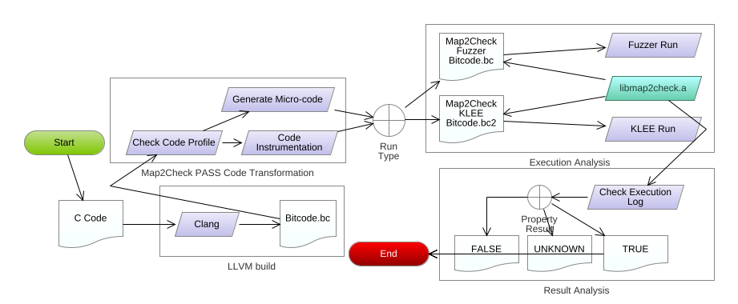

[](../master/LICENSE)
[](https://travis-ci.org/hbgit/map2check-library)
[](https://codecov.io/gh/hbgit/map2check-library)

# Map2Check-Library
It is a C library to support Map2Check Tool that performs over program analysis:

- Tracking the basic blocks 
- Tracking the memory addresses used in the memory management, e.g., deference operations
- Tracking the nondeterministic values generated by KLEE and LibFuzzer
- Checking of safety properties, e.g.: overflow, invalid memory, and assert defined by the user 
- Providing an API wrapper to call map2check-library functions

## To build the map2check-library

You can use the [build.sh](build.sh) script, but it's necessary to install all map2check-library dependencies:

```Console
$ ./build.sh --debug
```

You can also use our dockerfile to set up the environment to build map2check-library, as follows:

```Console
$ docker build -t hbgit/map2checklibrary --no-cache -f Dockerfile .
$ docker pull klee/klee:2.2
$ sudo apt install -y python3-pip
$ pip3 install --user cpp-coveralls
# Building the tool
$ docker run --rm -v $(pwd):/home/:Z --user $(id -u):$(id -g) hbgit/map2checklibrary /bin/bash -c "cd home/; ./build.sh -d -t"
# KLEE and LibFuzzer testing
$ ./run_klee_test.sh
```

<!-- Using https://mermaidjs.github.io/mermaid-live-editor -->

## Map2Check flow with the library

- This figure shows how the map2check-library is integrated in the Map2Check tool. In the release is generated two version of the library, (1) a static library with the sufix .a, and (2) a llvm library with sufix .bc.

<!-- from https://app.genmymodel.com/ -->
<center>

</center>


## **New Model and Library Flow**

In this new data model, we aims to create a model object for each data structure that need a data storage, e.g., NonDetLog that has all data about nondet call functions. In this sense, we have a Container object that handle with the storage for each data structure.

<!-- from https://app.genmymodel.com/ -->
<center>

</center>


## Files Type

### Caller

- The files are simple C++ file (not modelling as class), its goal is to be adopted as wrapper to call the library features using extern "C". This way, the focus is keep simple to be integrated with LLVM-link or adopted as an API in C source code.

### Analysis Mode

- The files that modelling and performing the verification condition to be adopted by Map2Check tool, such as: overflow, memory safety, and reachability error.

### Container

- The files the modelling the data storage, different from the old library, we do not adopt temporary files, and all data gathered are shown in the end of the program analysis.

### NonDetGen

- The files that modelling and performing the generation of nondeterministic values, called by __VERIFIER_nondet_* function in Map2Check tool. The tools supported by the library are KLEE and LibFuzzer.


## How is the output from map2check-library execution?

After the verification condition from map2check-library to be validate using KLEE or LibFuzzer a JSON (specification RFC 8259) string is shown with all data collected in the execution analysis, as following:

```json
{
  "Output": {
    "Result"     : "string",
    "LineNumber" : "unsigned",
    "Property"   : ["TRUE", "FALSE", "UNKWNON"],
    "Container_NonDetLog": [
      {
        "step"         : "01",
        "line"         : "unsigned",
        "scope"        : "unsigned",
        "value"        : "typename T",
        "function_name": "const char *"
      }
    ],
    "Container_AllocationLog": [
      {
        "step"           : "01",
        "address"        : "long",
        "size_to_destiny": "int"
      }
    ]
  }
}
```