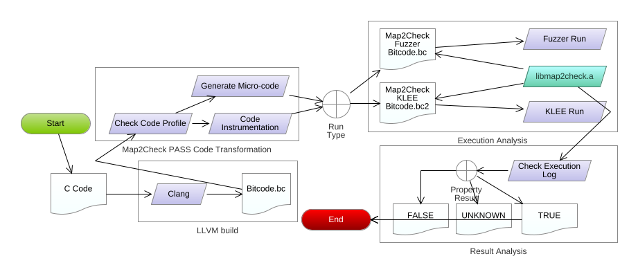

[](../master/LICENSE)
[](https://travis-ci.org/hbgit/map2check-library)
[](https://codecov.io/gh/hbgit/map2check-library)

# Map2Check-Library

Biblioteca de suporte à ferramenta [Map2Check](https://github.com/hbgit/map2check), reescrita em **Rust** (rewrite completo do C original). Provê rastreamento dinâmico e verificação de propriedades de segurança para programas analisados por KLEE ou LibFuzzer:

- Rastreamento de blocos básicos (`bbtrack`)
- Rastreamento de endereços de memória e operações de gerenciamento de memória (`memtrack`)
- Rastreamento de valores não-determinísticos gerados por KLEE e LibFuzzer (`nondet`)
- Verificação de propriedades de segurança: overflow aritmético, memória inválida, assert definido pelo usuário (`analysismode`)
- API C compatível via FFI (`ffi.rs`) para integração direta com a LLVM Pass do Map2Check

## Requisitos

- Rust 1.82+ (`rustup`, edição 2021)
- Para build de bitcode KLEE: `clang-8`, `llvm-link-8`
- Para cobertura: `cargo-tarpaulin`
- Para auditoria de dependências: `cargo-audit`, `cargo-deny`
- Para geração do header C: `cbindgen`

```sh
# Instalar ferramentas de desenvolvimento
rustup component add clippy rustfmt
cargo install cargo-tarpaulin cargo-audit cargo-deny cbindgen
```

## Build

### Biblioteca (debug)

```sh
cargo build
# Saída: target/debug/libmap2check.a + target/debug/libmap2check.rlib
```

### Biblioteca (release)

```sh
cargo build --release
# Saída: target/release/libmap2check.a
```

### Com suporte a LibFuzzer

```sh
cargo build --release --features libfuzzer
```

### Com suporte a KLEE (bitcode)

```sh
RUSTFLAGS="--emit=llvm-bc" cargo build --release --features klee
llvm-link-8 target/release/deps/*.bc -o libmap2check_klee.bc
```

### Gerar header C (cbindgen)

```sh
cbindgen --config cbindgen.toml --crate map2check-library --output map2check.h
```

### Build via Docker (multi-stage)

```sh
# Constrói todas as etapas: builder → klee-bc → test+coverage → imagem final
docker build -t hbgit/map2check-library .

# Executar testes dentro do container
docker run --rm hbgit/map2check-library

# KLEE integration test
docker pull klee/klee:2.2
./run_klee_test.sh
```

## Testes

```sh
# Todos os testes (36 testes unitários)
cargo test

# Testes de um módulo específico
cargo test memtrack
cargo test analysismode::overflow
cargo test output

# Com output detalhado
cargo test -- --nocapture

# Com todas as features ativadas
cargo test --all-features
```

## Cobertura

```sh
cargo tarpaulin --out Html --output-dir coverage/ --all-features
# Relatório: coverage/tarpaulin-report.html
# Meta: ≥ 80%
```

## Linting e Auditoria

```sh
# Clippy com regras pedantic
cargo clippy -- -W clippy::pedantic -W clippy::nursery -D warnings

# Verificação de vulnerabilidades conhecidas
cargo audit

# Verificação de licenças e políticas de dependência
cargo deny check
```

## Arquitetura

### Estrutura de Módulos

```
rust/src/
├── lib.rs                     # Raiz da crate; re-exports
├── error.rs                   # Map2CheckError (thiserror)
├── state.rs                   # AnalysisState + OnceLock<Arc<Mutex<...>>>
├── ffi.rs                     # ÚNICO módulo com unsafe — extern "C" ABI
├── caller/mod.rs              # ViolatedProperty, AnalysisResult, step counter
├── nondet/
│   ├── mod.rs                 # NonDetValue (enum), NonDetEntry
│   └── libfuzzer.rs           # LLVMFuzzerTestOneInput (feature = "libfuzzer")
├── memtrack/mod.rs            # MemTrackEntry, VCC checks de memória
├── bbtrack/mod.rs             # BasicBlockEntry, busca por linha
├── analysismode/
│   ├── mod.rs                 # VccChecker trait, VccContext, VccOutcome
│   ├── assert.rs              # AssertChecker
│   ├── overflow.rs            # AddI32, SubI32, MulI32 ... (checked_* arithmetic)
│   └── memory.rs              # LoadChecker, FreeChecker, DerefChecker, MemCleanupChecker
└── output/mod.rs              # to_json(), print_json() via serde_json
```

### Conectividade com Map2Check

```
Map2Check Tool (LLVM Pass / Instrumentação)
        │
        │  extern "C" ABI  (ffi.rs)
        ▼
┌─────────────────────────────────────────────┐
│           libmap2check.a / .bc              │
│                                             │
│  caller ─┐                                 │
│  nondet  ├──► AnalysisState                │
│  memtrack│    OnceLock<Arc<Mutex<...>>>     │
│  bbtrack ┘                                 │
│                                             │
│  analysismode ──► VccChecker trait          │
│  output   ──► serde_json                   │
└─────────────────────────────────────────────┘
        │
        │  llvm-link-8
        ▼
libmap2check_klee.bc / libmap2check_libfuzzer.bc
```

### Decisões de Segurança

| Padrão C | Equivalente Rust |
|---|---|
| `TAILQ` globais sem lock | `OnceLock<Arc<Mutex<AnalysisState>>>` |
| `union Data` (type-punning) | `NonDetValue` enum com dados; `f32::from_bits()` |
| Buffer fixo `char[512]` sem bounds | `serde_json::to_string()` — tamanho dinâmico |
| `search_in_container_by_address` retorna ponteiro não-inicializado | `find_by_address` retorna `Option<&MemTrackEntry>` |
| Aritmética `INT_MAX/INT_MIN` manual | `i32::checked_add()`, `checked_sub()` etc. |
| `lib/json-maker.c` + `ftoa.c` | `serde_json` + `#[derive(Serialize)]` |

**Política de `unsafe`**: somente `ffi.rs` contém blocos `unsafe`. Todos os outros módulos têm `#![deny(unsafe_code)]`. Cada bloco unsafe em `ffi.rs` possui um comentário `// SAFETY:`.

## Output JSON

Ao final da análise, `print_all_containers_as_json()` emite no stdout:

```json
{
  "map2check_log": {
    "result": "true",
    "property": "NONE",
    "step": 42,
    "line": 0,
    "function_name": "",
    "Container_NonDetLog": [
      {
        "step": 1,
        "line": 10,
        "scope": 0,
        "function_name": "main",
        "value": { "type": "INT", "value": 7 }
      }
    ],
    "Container_TrackBBLog": [ ... ],
    "Container_AllocationLog": [ ... ]
  }
}
```

`Container_AllocationLog` só é incluído quando a violação é de segurança de memória (`MemsafetyFree`, `MemsafetyDeref`, `MemsafetyMemcleanup`).

## Map2Check flow com a biblioteca

<center>

</center>
